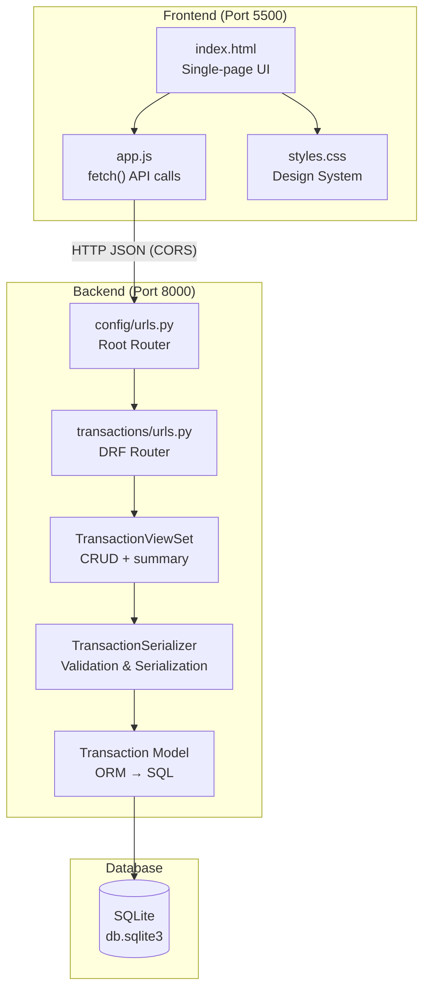
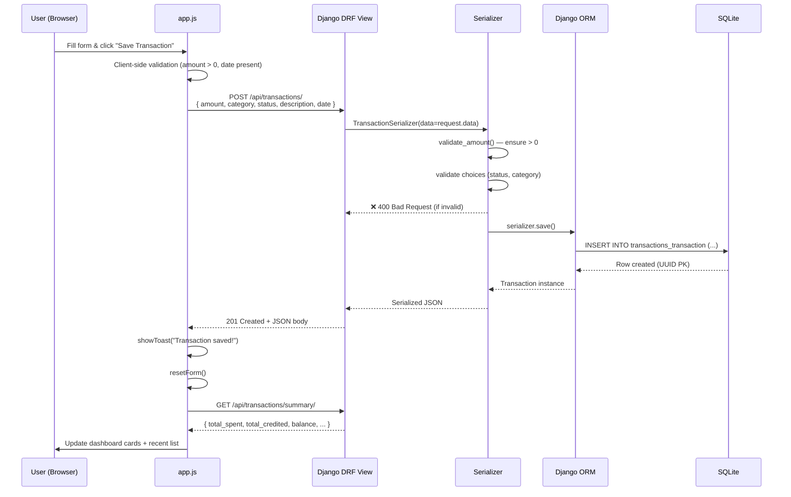
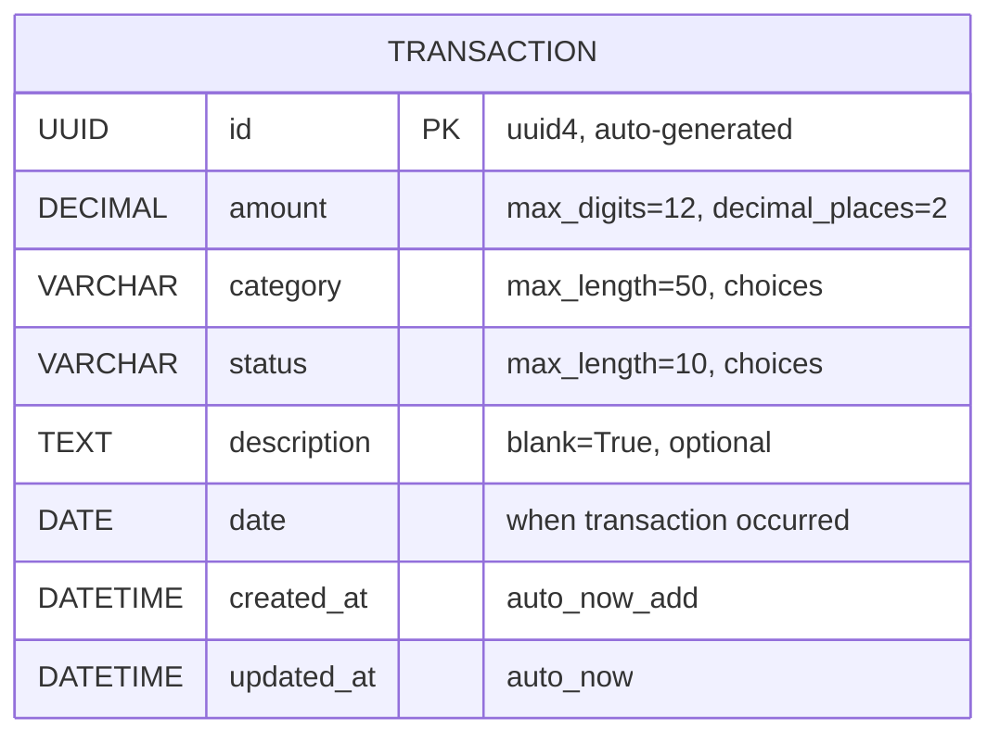
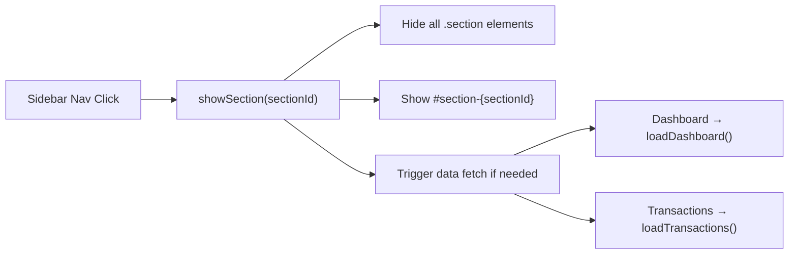

# 💰 Money Manager — Complete Project Deep Dive

> A recruiter-ready, end-to-end walkthrough of your full-stack money management application.

---

## 1. What Is This Project?

Money Manager is a **full-stack personal finance tracker** that lets you record income and expenses, view a dashboard with live statistics, and filter/delete transactions. It demonstrates:

- Backend API design with **Django + Django REST Framework**
- Frontend SPA-like behavior with **Vanilla JavaScript** (no React/Vue)
- A **CSS design system** with dark/light themes, glassmorphism, and responsive layout
- Clean **separation of concerns**: API ↔ UI communicate purely via JSON

---

## 2. High-Level Architecture



| Layer | Technology | Port |
|-------|-----------|------|
| **Frontend** | HTML5 + Vanilla CSS + JavaScript | `5500` (Python HTTP server) |
| **Backend** | Django 5.x + DRF 3.15+ | `8000` (Django runserver) |
| **Database** | SQLite (dev) → PostgreSQL (prod) | Embedded file |
| **Cross-Origin** | `django-cors-headers` | — |

---

## 3. End-to-End Data Flow

Here is exactly what happens when a user adds a new transaction:



### Step-by-step breakdown:

1. **User fills the form** — selects Expense/Income toggle, enters amount, picks a category chip, sets date, optionally adds description
2. **Client-side validation** — `app.js` checks `amount > 0` and `date` is present before making any network call
3. **`fetch()` POST** — sends JSON payload to `http://127.0.0.1:8000/api/transactions/` with `Content-Type: application/json`
4. **CORS middleware** — `django-cors-headers` adds `Access-Control-Allow-Origin` headers (frontend is on port 5500, backend on 8000)
5. **DRF Router** dispatches to `TransactionViewSet.create()` (inherited from `ModelViewSet`)
6. **Serializer validates** — `TransactionSerializer.validate_amount()` rejects ≤0; DRF auto-validates `choices` fields
7. **ORM saves** — Django generates a `UUID` primary key, runs `INSERT`, sets `auto_now_add` timestamps
8. **201 response** — full transaction JSON sent back
9. **Frontend updates** — toast notification, form reset, auto-navigate to Dashboard, re-fetch summary stats

---

## 4. Django Model Design

There is a single model: **`Transaction`**

### 4.1 Entity-Relationship Diagram



### 4.2 Field-by-Field Rationale

| Field | Type | Why This Design |
|-------|------|----------------|
| `id` | `UUIDField` (PK) | **Security**: no sequential IDs, so attackers can't guess `/api/transactions/5/`. **Scalability**: UUIDs are globally unique — safe for distributed DBs and future microservices. |
| `amount` | `DecimalField(12,2)` | **Precision**: `Decimal` avoids floating-point rounding issues (critical for financial apps). Supports up to ₹9,999,999,999.99. |
| `category` | `CharField` with `choices` | **Enumeration**: 10 predefined categories. Using `choices` gives both DB-level validation and human-readable display via `get_category_display()`. |
| `status` | `CharField` with `choices` | **Binary**: `'spent'` or `'credited'`. This is the core dimension that determines if money went in or out. |
| `description` | `TextField(blank=True)` | **Optional free-text**. `blank=True` + `default=''` means the field is optional at both form and DB levels. |
| `date` | `DateField` | **User-specified date** — when the transaction actually happened (may differ from creation time). |
| `created_at` | `DateTimeField(auto_now_add)` | **Audit**: automatically set once on creation. Immutable. |
| `updated_at` | `DateTimeField(auto_now)` | **Audit**: automatically updated on every `.save()`. Useful for tracking edits. |

### 4.3 Model Meta & Ordering

```python
class Meta:
    ordering = ['-date', '-created_at']  # Newest first
    verbose_name = 'Transaction'
    verbose_name_plural = 'Transactions'
```

- **Default ordering** means every `Transaction.objects.all()` query returns newest transactions first — the dashboard and table don't need explicit sorting.
- The `__str__` method returns `"Spent ₹250.00 — Food & Dining (2026-05-01)"` — useful in Django Admin and debugging.

### 4.4 Category & Status Choices

```python
CATEGORY_CHOICES = [
    ('food', 'Food & Dining'),           # 🍕
    ('transport', 'Transport & Fuel'),    # 🚗
    ('shopping', 'Shopping & Lifestyle'), # 🛍️
    ('bills', 'Bills & Utilities'),       # 💡
    ('health', 'Health & Medical'),       # 🏥
    ('entertainment', 'Entertainment'),   # 🎬
    ('salary', 'Salary & Income'),        # 💰
    ('freelance', 'Freelance Income'),    # 💻
    ('investment', 'Investments'),        # 📈
    ('other', 'Miscellaneous'),           # 📋
]

STATUS_CHOICES = [
    ('spent', 'Spent'),
    ('credited', 'Credited'),
]
```

> [!TIP]
> The DB stores short keys (`'food'`, `'spent'`), not display strings. This keeps storage efficient and makes filtering fast. The serializer adds `category_display` and `status_display` computed fields for the UI.

---

## 5. Relationships (Current & Future)

Currently, the app has **no relationships** — it's a single-table design. This is intentional for Phase 1 (MVP). Here's how it would expand:

```mermaid
erDiagram
    USER ||--o{ TRANSACTION : "owns (Phase 2)"
    CATEGORY ||--o{ TRANSACTION : "belongs to (Phase 4)"
    BUDGET ||--o{ CATEGORY : "limits (Phase 6)"
    RECURRING ||--o{ TRANSACTION : "generates (Phase 6)"

    USER {
        int id PK
        string email
        string password_hash
    }
    TRANSACTION {
        UUID id PK
        FK user_id
        FK category_id
        decimal amount
    }
    CATEGORY {
        int id PK
        string name
        string emoji
        FK user_id
    }
    BUDGET {
        int id PK
        FK category_id
        decimal limit_amount
        string period
    }
    RECURRING {
        int id PK
        FK user_id
        string frequency
        decimal amount
    }
```

---

## 6. API Design (DRF)

### 6.1 URL Routing Chain

```
Browser request: GET /api/transactions/

1. config/urls.py        →  path("api/", include("transactions.urls"))
2. transactions/urls.py  →  router.register('transactions', TransactionViewSet)
3. DRF DefaultRouter     →  auto-generates:
                              GET    /api/transactions/          → list()
                              POST   /api/transactions/          → create()
                              GET    /api/transactions/{id}/     → retrieve()
                              PUT    /api/transactions/{id}/     → update()
                              DELETE /api/transactions/{id}/     → destroy()
                              GET    /api/transactions/summary/  → summary()  [custom]
```

### 6.2 ViewSet Design

The `TransactionViewSet` extends `ModelViewSet`, which gives full CRUD for free. Two custom additions:

#### Custom Queryset Filtering (Server-side)

```python
def get_queryset(self):
    qs = Transaction.objects.all()
    status_filter = self.request.query_params.get('status')     # ?status=spent
    category_filter = self.request.query_params.get('category') # ?category=food
    if status_filter:
        qs = qs.filter(status=status_filter)
    if category_filter:
        qs = qs.filter(category=category_filter)
    return qs
```

> [!NOTE]
> This is manual filtering for simplicity. In production, you'd use `django-filter` with `DjangoFilterBackend` for cleaner, more scalable filtering.

#### Custom `summary` Action

```python
@action(detail=False, methods=['get'])
def summary(self, request):
```

- `detail=False` → operates on the collection (not a single item), so URL is `/api/transactions/summary/`
- Uses Django ORM aggregation: `Sum('amount')`, `Count('id')`
- Returns category-level breakdown for expense analytics

### 6.3 Serializer Design

```python
class TransactionSerializer(serializers.ModelSerializer):
    category_display = serializers.CharField(source='get_category_display', read_only=True)
    status_display = serializers.CharField(source='get_status_display', read_only=True)
```

**Key points:**
- **Computed fields**: `category_display` and `status_display` are read-only fields that call Django's `get_FOO_display()` method — so the API returns both `"food"` and `"Food & Dining"`
- **Read-only fields**: `id`, `created_at`, `updated_at` are auto-generated, never accepted from client input
- **Custom validation**: `validate_amount()` rejects zero or negative values with a clear error message

### 6.4 API Endpoint Reference

| Method | Endpoint | Action | Request Body | Response |
|--------|----------|--------|-------------|----------|
| `GET` | `/api/transactions/` | List all | — | `[{id, amount, category, ...}, ...]` |
| `GET` | `/api/transactions/?status=spent&category=food` | Filtered list | — | Filtered array |
| `POST` | `/api/transactions/` | Create | `{amount, category, status, date, description?}` | `201` + created object |
| `GET` | `/api/transactions/{uuid}/` | Get one | — | Single transaction object |
| `PUT` | `/api/transactions/{uuid}/` | Full update | All fields | Updated object |
| `PATCH` | `/api/transactions/{uuid}/` | Partial update | Changed fields only | Updated object |
| `DELETE` | `/api/transactions/{uuid}/` | Delete | — | `204 No Content` |
| `GET` | `/api/transactions/summary/` | Statistics | — | `{total_spent, total_credited, balance, transaction_count, category_breakdown}` |

### 6.5 Example API Responses

**POST `/api/transactions/`** (Create):
```json
{
  "id": "a1b2c3d4-e5f6-7890-abcd-ef1234567890",
  "amount": "250.00",
  "category": "food",
  "category_display": "Food & Dining",
  "status": "spent",
  "status_display": "Spent",
  "description": "Lunch at office canteen",
  "date": "2026-05-01",
  "created_at": "2026-05-01T11:30:00.000000+05:30",
  "updated_at": "2026-05-01T11:30:00.000000+05:30"
}
```

**GET `/api/transactions/summary/`**:
```json
{
  "total_spent": "4500.00",
  "total_credited": "50000.00",
  "balance": "45500.00",
  "transaction_count": 15,
  "category_breakdown": {
    "food": { "total": "2500.00", "count": 8 },
    "transport": { "total": "1200.00", "count": 4 },
    "bills": { "total": "800.00", "count": 3 }
  }
}
```

---

## 7. Frontend Architecture

### 7.1 SPA-Like Navigation (No Framework)

The frontend is a **single HTML file** that behaves like a Single Page Application:



- Three sections: **Dashboard**, **Add Transaction**, **All Transactions**
- CSS class `.active` toggles visibility with `display: none/block`
- Each section has a `fadeIn` animation on activation

### 7.2 JavaScript Module Breakdown

| Function | Purpose |
|----------|---------|
| `initTheme()` | Reads `localStorage('mm-theme')`, sets `data-theme` attribute, handles toggle |
| `initNavigation()` | Binds sidebar nav clicks, hamburger menu for mobile |
| `initForm()` | Binds toggle buttons, category chips, form submit |
| `handleSubmit()` | Validates → `fetch POST` → toast → reset → redirect to dashboard |
| `loadDashboard()` | Parallel fetches: `summary/` + `transactions/` → updates 4 stat cards + recent list |
| `loadTransactions()` | Reads filter dropdowns → builds URL with query params → fetches → renders table |
| `confirmDelete()` / `executeDelete()` | Opens modal → on confirm, `fetch DELETE` → refreshes both views |
| `showToast()` | Creates animated notification (success/error/info), auto-removes after 3s |
| `animateValue()` | Formats currency in Indian notation (₹1,00,000.00) |

### 7.3 How Filters Work

```
User selects "Expenses" + "Food"
  ↓
JS reads: filterStatus.value = "spent", filterCategory.value = "food"
  ↓
Builds URL: /api/transactions/?status=spent&category=food
  ↓
Django get_queryset() chains: qs.filter(status="spent").filter(category="food")
  ↓
SQL: SELECT * FROM transactions_transaction WHERE status='spent' AND category='food' ORDER BY date DESC, created_at DESC
  ↓
JSON response → renderTable() rebuilds tbody innerHTML
```

---

## 8. CSS Design System

### 8.1 Design Tokens (CSS Variables)

The entire visual system is driven by **CSS custom properties**:

```css
:root {                                    /* Dark theme (default) */
    --bg-primary: #0f1117;
    --accent: #6366f1;                     /* Indigo */
    --green: #22c55e;                      /* Income color */
    --red: #ef4444;                        /* Expense color */
    --radius: 12px;
    --transition: 0.2s cubic-bezier(...);
}
[data-theme="light"] {                     /* Overrides for light mode */
    --bg-primary: #f8fafc;
    --text-primary: #1e293b;
}
```

### 8.2 Design Features

| Feature | Implementation |
|---------|---------------|
| **Dark/Light mode** | `data-theme` attribute on `<html>`, toggled via JS, persisted in `localStorage` |
| **Glassmorphism** | `backdrop-filter: blur(12px)` + semi-transparent `rgba` backgrounds on cards |
| **Responsive layout** | CSS Grid + Flexbox, media queries at `768px` and `480px` breakpoints |
| **Micro-animations** | `fadeIn` (sections), `slideIn` (transactions), `toastIn/Out`, `modalIn`, `spin` (loader) |
| **Typography** | Inter font from Google Fonts, 6 weight levels (300–800) |
| **Mobile sidebar** | CSS `transform: translateX(-100%)` → `translateX(0)` with `.open` class |

---

## 9. Django Admin Configuration

```python
@admin.register(Transaction)
class TransactionAdmin(admin.ModelAdmin):
    list_display = ['date', 'amount', 'category', 'status', 'description_short', 'created_at']
    list_filter = ['status', 'category', 'date']
    search_fields = ['description']
    ordering = ['-date', '-created_at']
    readonly_fields = ['id', 'created_at', 'updated_at']
```

This gives a fully functional admin panel at `/admin/` with:
- Sortable columns, sidebar filters, search bar
- Truncated descriptions (60 chars max in list view)
- Protected auto-fields (UUID, timestamps)

---

## 10. Security & Configuration

### What's in place:
| Aspect | Status | Details |
|--------|--------|---------|
| **CORS** | ✅ Configured | `django-cors-headers` with whitelisted origins |
| **CSRF** | ✅ Middleware active | But API is exempt since it uses JSON-only (no cookies/sessions) |
| **UUID PKs** | ✅ | Prevents IDOR (Insecure Direct Object Reference) via sequential ID guessing |
| **Input validation** | ✅ | DRF serializer validates types, choices, amount > 0 |
| **SQL injection** | ✅ Protected | Django ORM parameterizes all queries |
| **XSS** | ⚠️ Partial | `innerHTML` is used in JS — currently safe because data is from your own API, but should sanitize in multi-user mode |

### What needs hardening for production:
| Issue | Fix |
|-------|-----|
| `SECRET_KEY` is hardcoded | Move to environment variable (`os.environ.get(...)`) |
| `DEBUG = True` | Set `False` in production |
| `CORS_ALLOW_ALL_ORIGINS = True` | Remove; keep only whitelisted origins |
| `ALLOWED_HOSTS = []` | Set to your domain |
| No authentication | Add Django auth or JWT (Phase 2) |
| SQLite | Switch to PostgreSQL (Phase 5) |

---

## 11. Project Dependencies

```
django>=5.0,<7.0          # Core framework — ORM, admin, request/response cycle
djangorestframework>=3.15  # DRF — serializers, viewsets, routers, response formatting
django-cors-headers>=4.0   # Enables cross-origin requests (frontend ≠ backend port)
```

> [!NOTE]
> Only 3 dependencies. This is intentionally minimal — no heavy ORM plugins, no Celery, no Redis. The app can be set up with a single `pip install`.

---

## 12. How to Run (Quick Reference)

```bash
# Terminal 1 — Backend
cd MoneyManager
source venv/bin/activate
cd backend
python manage.py runserver 8000       # API at http://127.0.0.1:8000

# Terminal 2 — Frontend
cd MoneyManager/frontend
python3 -m http.server 5500           # UI at http://127.0.0.1:5500

# Admin panel
http://127.0.0.1:8000/admin/          # (requires createsuperuser)
```

---

## 13. Interview-Ready Talking Points

### 🎯 "Tell me about this project"

> "I built a full-stack money management application using Django REST Framework for the backend and vanilla JavaScript for the frontend. It features a clean REST API with full CRUD, a dashboard with real-time aggregated statistics, dark/light theme support, and a responsive glassmorphism UI. I intentionally kept the frontend framework-free to demonstrate strong fundamentals in DOM manipulation, fetch API, and CSS architecture."

### 🎯 "Why UUID instead of auto-increment?"

> "UUIDs prevent IDOR attacks — with sequential IDs, an attacker could guess `/api/transactions/1/`, `/2/`, `/3/` to access other records. UUIDs are also globally unique, which makes them safe for distributed databases and future microservice architectures."

### 🎯 "Why DecimalField and not FloatField?"

> "Financial calculations require exact precision. `FloatField` uses IEEE 754 floating point, which can produce rounding errors like `0.1 + 0.2 = 0.30000000000000004`. `DecimalField` maps to Python's `Decimal` type and SQL's `DECIMAL`, ensuring exact arithmetic."

### 🎯 "Why no React/Vue?"

> "For this project scope (3 pages, no complex state), a framework adds unnecessary bundle size and build tooling. Vanilla JS with `fetch()` and DOM manipulation keeps the app lightweight (~11KB JS, ~15KB CSS) and demonstrates understanding of the browser APIs that frameworks abstract away."

### 🎯 "How does filtering work?"

> "Filtering happens server-side. The frontend builds query parameters like `?status=spent&category=food`, the DRF ViewSet's `get_queryset()` reads them from `request.query_params` and chains Django ORM `.filter()` calls. This keeps the filtering logic centralized and works regardless of dataset size."

### 🎯 "What would you add next?"

> "The roadmap has 5 remaining phases: (1) User authentication with Django auth or JWT so each user sees only their transactions, (2) Dashboard charts with Chart.js, (3) AI-powered auto-categorization, (4) AWS deployment with ECS, RDS PostgreSQL, S3, and CloudFront, (5) Budget alerts and recurring transactions. The single-model design was intentional — adding a User FK is a one-line model change plus a migration."

### 🎯 "How does the summary endpoint work?"

> "It's a custom DRF action using `@action(detail=False)`. It runs two aggregation queries — `Sum('amount')` filtered by `status='spent'` and `status='credited'` — then calculates the balance in Python. It also does a category breakdown using `values('category').annotate(total=Sum('amount'), count=Count('id'))`, which generates a `GROUP BY` SQL query. All of this respects the active filters from query parameters."

---

## 14. Potential Interview Follow-up Questions

| Question | Key Points to Mention |
|----------|----------------------|
| "How would you add pagination?" | `REST_FRAMEWORK['DEFAULT_PAGINATION_CLASS'] = 'rest_framework.pagination.PageNumberPagination'` + set `PAGE_SIZE` |
| "How would you handle concurrent writes?" | Django's `F()` expressions for atomic updates, or `select_for_update()` for row-level locking |
| "How would you deploy this?" | Dockerize → ECS/EKS, PostgreSQL on RDS, static files on S3 + CloudFront, HTTPS via ACM |
| "How would you add tests?" | `pytest-django` + DRF's `APIClient`. Test serializer validation, ViewSet CRUD, summary aggregation, filter combos |
| "Why CORS instead of same-origin?" | In dev, frontend and backend run on different ports. In prod, you'd either serve from same origin (Nginx reverse proxy) or keep CORS with strict whitelisting |
| "What's `auto_now` vs `auto_now_add`?" | `auto_now_add` → set once on creation (immutable). `auto_now` → updated on every `.save()` call. Neither can be set manually. |

---

> [!IMPORTANT]
> **Key strength of this project**: It demonstrates understanding of the *full vertical stack* — from CSS custom properties and responsive design, through JavaScript async/await and DOM manipulation, to Django ORM aggregation and REST API design. That breadth is exactly what interviewers look for in a full-stack developer.
